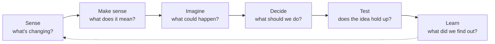

# Futures & Innovation Toolkit

A map of open-source [Claude](https://claude.ai) skills and templates for foresight, strategy and prototyping. It's for people who need to work out what's changing, imagine what could happen, decide what to do about it, and test ideas before committing to them.

Every tool here works on its own. Together they cover a full cycle, from spotting a signal to testing a prototype with real people, and the outputs of one are designed to feed the next.

## Underneath it all: a workspace that remembers

[**Coppice**](https://github.com/greencat667/coppice) is the working environment these tools were built in: plain files that give an assistant persistent context about you and your work. It has a profile, a session protocol, lean task and memory files, and numbered projects with logs. A weekly trim and a health check keep it small enough to stay fast. None of the tools below need it, but they work best inside it, and several of them (the scheduled signal scan, the grant scanner, the wiki tasks, the skill-gap detector) write their output into the folders it sets up.

## The tools

### Sense: what's changing?

| Tool | What it does |
|---|---|
| [trend-signal-monitor](https://github.com/greencat667/trend-signal-monitor-skill-claude) | Weekly scheduled scan of the topics you track: rated findings, verified links, one headline digest |
| [grant-scanner](https://github.com/greencat667/grant-scanner-skill-claude) | Weekly scan for funding opportunities that match your organisation, deduplicated against past runs |
| [whiteboard-extraction](https://github.com/greencat667/whiteboard-extraction-skill-claude) | Pulls sticky notes and comments out of workshop whiteboards into structured, usable text |

### Make sense: what does it mean?

| Tool | What it does |
|---|---|
| [trend-report](https://github.com/greencat667/trend-report-skill-claude) | A deep, cited 14-section report on one trend: signals, systems, SWOT, three horizons, scenarios, second-order effects, learning priorities |
| [signal-clustering](https://github.com/greencat667/signal-clustering-skill-claude) | Turns a signals log into named emerging patterns, scored and checked against counter-signals and your assumptions, and tracked over time |
| [futures-wheel](https://github.com/greencat667/futures-wheel-skill-claude) | Maps the first-, second- and third-order consequences of a single change, with diverse simulated perspectives |

### Imagine: what could happen?

| Tool | What it does |
|---|---|
| [scenario-builder](https://github.com/greencat667/scenario-builder-skill-claude) | Four contrasting futures from two critical uncertainties, with early-warning indicators and robust moves |
| [persona-panel](https://github.com/greencat667/persona-panel-skill-claude) | Tests how different people might react to a message or idea (panel), or how opinion shifts over a conversation (swarm) |
| [britain-talks-climate-persona-prompts](https://github.com/greencat667/britain-talks-climate-persona-prompts) | Ready-made personas and a focus group based on published UK climate-attitudes segmentation research |

### Decide: what should we do?

| Tool | What it does |
|---|---|
| [strategic-wargame](https://github.com/greencat667/strategic-wargame-skill-claude) | Plays out a strategy against simulated opponents, allies and events, round by round |
| [foresight](https://github.com/greencat667/foresight-skill-claude) | Calibrated forecasts on resolvable questions, logged to a ledger and scored over time |
| [superforecaster](https://github.com/greencat667/claude-cowork-superforecaster) | An autonomous forecasting loop that scores its own predictions and improves its methods |
| [options-paper](https://github.com/greencat667/options-paper-skill-claude) | A structured decision paper comparing options, with a recommendation |

### Test: does the idea hold up?

| Tool | What it does |
|---|---|
| [experiment-card](https://github.com/greencat667/experiment-card-skill-claude) | Finds an idea's riskiest assumption and designs the cheapest test that could prove it wrong, with thresholds set in advance |
| [rapid-prototype](https://github.com/greencat667/rapid-prototype-skill-claude) | A clickable single-file prototype for testing with real people, with a built-in session log and test script |
| [project-brief](https://github.com/greencat667/project-brief-skill-claude) | Turns an idea that has passed its tests into a project brief |

### Learn: what did we find out?

| Tool | What it does |
|---|---|
| [experiment-card](https://github.com/greencat667/experiment-card-skill-claude) (learning mode) | Compares results against the thresholds set in advance and makes a persevere / pivot / kill call |
| [web-vis](https://github.com/greencat667/web-vis-skill-claude) | Turns a report or analysis into an interactive web page people will actually read |
| [llm-wiki](https://github.com/greencat667/llm-wiki-skills-claude) | A convention and maintenance tasks for an AI-maintained knowledge wiki, so what you learn compounds |
| [autorefine](https://github.com/greencat667/autorefine-skill-claude) | Reviews a session to find where a skill or prompt wasted effort, and proposes improvements |
| [skill-gap-detector](https://github.com/greencat667/skill-gap-detector-skill-claude) | Scans your recent work for repeated tasks worth turning into a skill |

## Which one do I need?

| If your question is… | Start with |
|---|---|
| "What's new in the areas we care about?" | trend-signal-monitor |
| "We've collected lots of signals. What do they add up to?" | signal-clustering |
| "What's really going on with this trend?" | trend-report |
| "If this happens, what happens next?" | futures-wheel |
| "What futures should we prepare for?" | scenario-builder |
| "How likely is this, by when?" | foresight |
| "How would others respond if we did this?" | strategic-wargame |
| "How might different people react to this message?" | persona-panel, britain-talks-climate-persona-prompts |
| "Which of these options should we choose?" | options-paper |
| "Is this idea worth building?" | experiment-card |
| "Can people actually use it?" | rapid-prototype |
| "We've decided. How do we plan it?" | project-brief |
| "I want my assistant to remember me and my work between sessions" | coppice |

## One topic, all the way through

The worked examples in four of these repos follow a single fictional case: a regional environmental charity considering community tool libraries. Read them in order to see how each output feeds the next:

1. **[Trend report](https://github.com/greencat667/trend-report-skill-claude/blob/main/trend-report/examples/community-tool-libraries-report.md)**: the landscape, with 61 real cited sources and three learning priorities
2. **[Scenarios](https://github.com/greencat667/scenario-builder-skill-claude/blob/main/scenario-builder/examples/community-tool-libraries-scenarios.md)**: four futures to 2036 built from the report's drivers, plus indicators and no-regret moves ([interactive matrix](https://github.com/greencat667/scenario-builder-skill-claude/blob/main/scenario-builder/examples/community-tool-libraries-scenarios.html): download it and open it in a browser)
3. **[Experiment cards](https://github.com/greencat667/experiment-card-skill-claude/blob/main/experiment-card/examples/tool-delivery-experiment-cards.md)**: one no-regret idea, doorstep tool delivery for renters, broken into assumptions, with the riskiest ones turned into tests
4. **[Prototype](https://github.com/greencat667/rapid-prototype-skill-claude/blob/main/rapid-prototype/examples/tool-delivery-prototype.html)**: a clickable booking journey (download it and open it in a browser) that tests the fee assumption, with its [test script](https://github.com/greencat667/rapid-prototype-skill-claude/blob/main/rapid-prototype/examples/tool-delivery-test-script.md)

The [signal-clustering example](https://github.com/greencat667/signal-clustering-skill-claude/tree/main/signal-clustering/examples) uses the same fictional charity: a real 54-entry signals log on repair, reuse and sharing, clustered into nine patterns.

The organisation and people are invented. The research behind them is real and cited.

## Installing

Each repo's README has its own instructions, but the easiest way is to **ask Claude to do it**. In Claude Code or Claude Cowork, say something like:

> "Install the scenario-builder, experiment-card and rapid-prototype skills from github.com/greencat667."

To set up the workspace itself, say *"Set up a Coppice workspace in this folder. Follow `skills/coppice-setup/SKILL.md` from github.com/greencat667/coppice."*

Claude will clone each repo and put the skill in the right place. Scheduled-task templates (trend-signal-monitor, grant-scanner, skill-gap-detector, llm-wiki) need a few details filled in; Claude can interview you for them and set up the schedule.

## Things to keep in mind

- **These tools support judgement. They don't replace it.** Scenarios aren't predictions, wargames aren't rehearsals of real events, and forecasts are only as good as their track record.
- **Simulated people aren't people.** Persona panels and synthetic walkthroughs are good for sharpening questions and catching obvious problems. They aren't evidence about what real people think or will do, and the skills say so.
- **AI makes factual mistakes.** Every skill that makes claims about the world is built to cite sources, and most check their own links. Still check anything you're going to rely on.
- **Not actively maintained.** These were published as one-time releases. Fork freely.

## License

This README is MIT licensed. Each tool has its own license (all MIT at the time of writing); see the individual repos.
